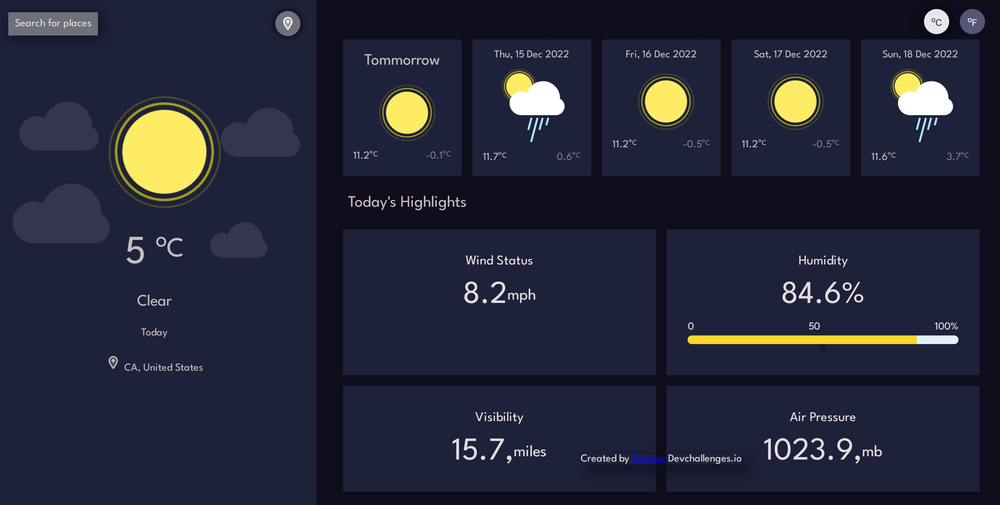

<!-- Please update value in the {}  -->

<h1 align="center">Weather App</h1>

   Live url here <a href="https://willowy-jelly-628fe3.netlify.app/" target="_blank">Weather App</a>.

### Built With

<!-- This section should list any major frameworks that you built your project using. Here are a few examples.-->

- [React](https://reactjs.org/)
- [MUI](https://mui.com)
